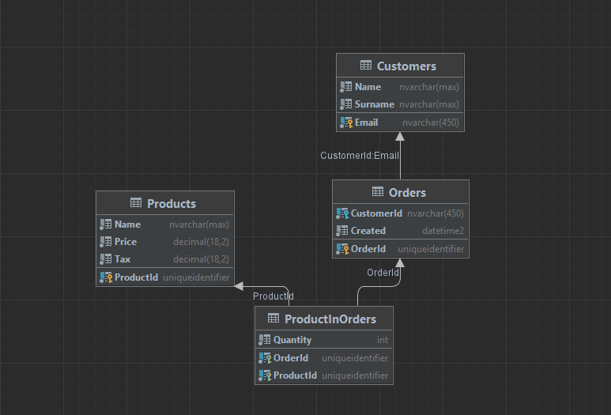
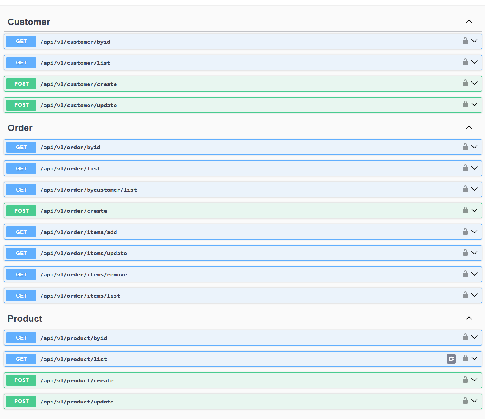

# SQL and ASP .NET Core API


## Stage 1 - Database structure
SQL query for create database: ``SQLQueris/ShopDb-init.sql``


## Stage 2 - SQL Queries

```
SQLQueries/queries.sql
```

## Stage 3 - API

1. Open terminal
2. Navigate to the directory where the project is located.

   ```bash
   docker compose up
   ```
   or just run project ``MiniDbApp.API`` by your favourite IDE. 

The default connection to the application is set to the following address: [http://localhost:8234](http://localhost:8234) *(docker compose)*

API key is``MXSszWxtvnK9BaN6fb4eA8L7CZTd2G``, you can change it in ``appsettings.json``

